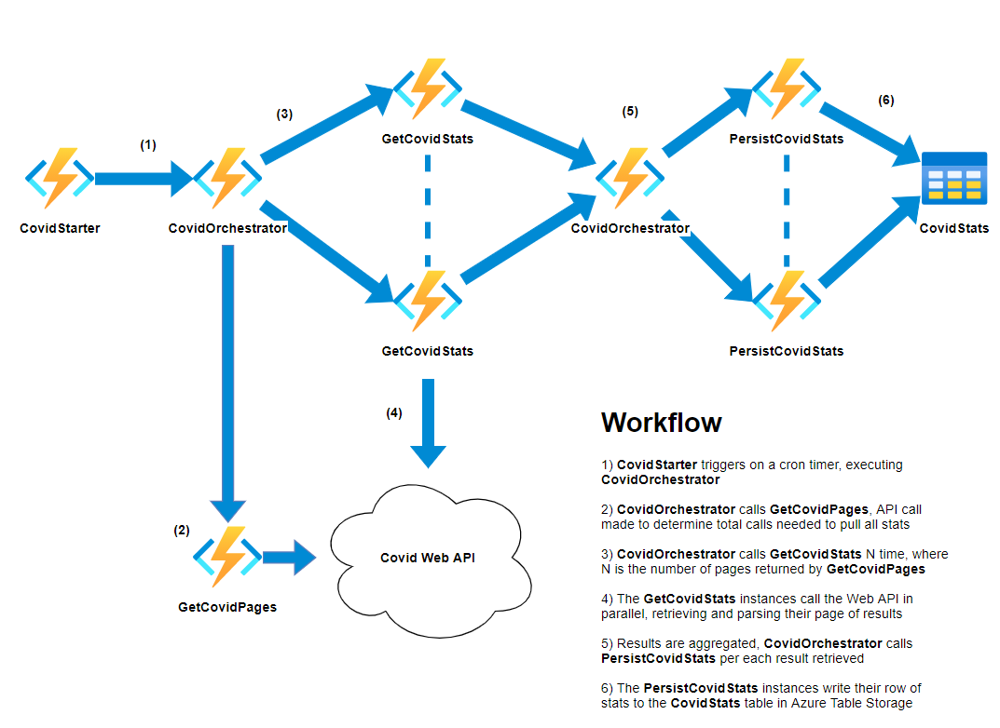

# Overview
It can be difficult to pull data from an api into a data visualization tool like Microsoft PowerBI if the api integration isn't supported out of the box. Code can be written to make the appropriate calls, but where the code is executed comes into question. Azure Functions provides a serverless compute service that allows for quick automated tasks to be developed and deployed without having to worry about the overhead of provisioning and maintaining infrastructure configurations.

For this example we will be capturing covid statistics from this endpoint:
``` 
https://corona-virus-stats.herokuapp.com/api/v1/cases/countries-search 
```
The results returned are paginated so multiple calls must be performed to capture all data. We will also be persisting the results to an Azure Storage table, but other persistence solutions can be utilized as well.


# Setup
Follow these [steps](https://docs.microsoft.com/en-us/azure/azure-functions/create-first-function-vs-code-python#configure-your-environment) to setup your VSCode environment for Azure Function development.

Follow these [extended steps](https://docs.microsoft.com/en-us/azure/azure-functions/durable/quickstart-python-vscode#install-azure-functions-durable-from-pypi) for installation of durable functions libraries for python.

